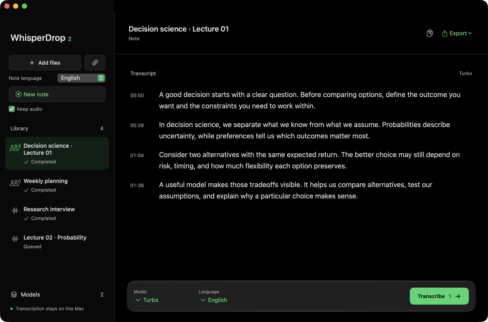

# WhisperDrop 2

Turn recordings, videos and meetings into text, right on your Mac. Record a lecture, transcribe a YouTube playlist, or dictate directly into another app.



*The app with sample lecture content.*

[Download the latest version](https://github.com/Zer0codestuff/whisperdrop-2/releases/latest) · Apple Silicon · macOS 14 or later

[Use WhisperDrop Web](https://whisperdrop-web-production.up.railway.app/) · Experimental · Hardware WebGPU required

## Features

- Transcribe audio and video files. Drag them into the app or choose them with the file picker.
- Import YouTube videos and entire playlists by pasting a link.
- Record lectures, calls and meetings using your microphone, system audio, or both. With Parakeet v3 the text appears a few seconds after it is spoken, one sentence per paragraph. Pause a note and resume it when you are ready.
- Save notes in your library, rename them by clicking the title, even while recording, and optionally keep the original audio. When recording both sources, the transcript labels them as You and Others.
- Dictate into other apps by holding a shortcut key. The words appear where your cursor is.
- Revise selected text with a shortcut using Draft's local writing tools. Review grammar, tone and wording suggestions, or summarize and organize transcripts as separate saved versions.
- Choose the spoken language once for files, dictation and notes, or let the app detect it. Add subject terms and names in Settings to help recognition.
- Read transcripts with timestamps, copy the text, or export plain text and SRT or VTT subtitles.
- Queue several recordings, cancel processing, retry failures, and return to saved transcripts later.
- Choose one model for everything in **Settings > Models**. Parakeet v3 is the default: it covers 25 European languages and is fast enough for dictation to write words into the text field while you speak. Whisper models remain available as legacy models for other languages and vocabulary hints; when your language needs one, an installed Whisper model is used automatically. Advanced settings can give dictation, notes or files their own model.
- Process speech locally. After downloading a model, you can transcribe local files, record notes and dictate offline.

## Use it in your browser

[WhisperDrop Web](https://whisperdrop-web-production.up.railway.app/) transcribes local files and microphone notes directly in your browser. It has a dark interface, a saved transcript library, optional note audio, and TXT, SRT and JSON export. Speech runs locally on your GPU through WebGPU. Railway hosts the website; audio and transcripts stay on your device.

Use a current Chrome or Edge browser with hardware WebGPU. The default Whisper Turbo Q4F16 model downloads about 564 MB of weights on first use and caches them in your browser. Turbo also needs GPU float16 support; Base is a smaller option. Keep the page open while recording. Browser storage is separate from the Mac app and belongs to the current browser profile and site, so export recordings and transcripts you need to keep.

The web version is experimental. It does not include the Mac app's global dictation, YouTube import or system audio capture. Recognition errors and browser recording limits remain; see the [browser evaluation](docs/web-evaluation.md) and [web implementation guide](web/README.md). A completely offline page reload is not guaranteed.

## Get started on Mac

1. Download the `.dmg` from the [latest release](https://github.com/Zer0codestuff/whisperdrop-2/releases/latest).
2. Drag **WhisperDrop 2.app** into Applications. If you are updating, quit the old version first and replace it.
3. Open the app and download a model in **Settings > Models** (also reachable from **Models** in the sidebar). Start with Parakeet v3. For a language it does not cover, download the legacy Turbo model.
4. Add a recording, paste a YouTube link, or choose **New note**.

Your Mac needs Apple Silicon and macOS 14 or later. Internet access is needed for model downloads and YouTube imports.

The current release is not notarized by Apple, so macOS may block the first launch. If you trust this build, try opening it once, then go to **System Settings > Privacy & Security > Open Anyway**. See [Apple's instructions](https://support.apple.com/en-us/102445). Updating the app keeps your existing notes, models and settings.

## App updates

Starting with 2.6.0, use **WhisperDrop 2 > Check for Updates…** or **Settings > General > App updates**. Daily checks are optional; installation asks for confirmation. Updating preserves downloaded models, saved files and the main writing draft. Versions before 2.6.0 have no updater and need one manual replacement first. See [in-app updates](docs/updates.md) for release setup and verified limits.

## Notes and dictation

Notes use the app language. To record one note in another language, choose it in **Note language** beside **New note**; the next note uses it once. Use **Keep audio** if you also want to save the recording. You can find kept audio later using the note's audio button.

To rename a note, click its title, type the new name and press Return. This works while the note is recording and after it is saved. You can also right-click a saved note in the library and choose **Rename…**.

**Pause** stops recording without closing the note. Nothing is recorded while paused, the timer stops, and **Resume** continues in the same note and audio files. While paused, the model can unload according to **Unload model**. **Stop and save** works from either state.

For dictation, hold **fn** while speaking and release it to insert the text. With Parakeet v3 and **Live text** set to **In the text field**, words appear in the field while you speak: native apps show every word and correct it in place, while browsers and other apps receive words once they settle, a few seconds behind. Press Escape to discard the dictation, including the words already written. Set **System Settings > Keyboard > Press 🌐 key to > Do Nothing** so macOS does not open its emoji picker or Dictation at the same time. You can choose a different shortcut in the app's Settings.

On first launch a short guide explains each feature and asks for the permissions they need. You can skip it and reopen it from Help. Microphone access enables voice capture; Accessibility and Input Monitoring enable dictation; system audio access enables recording calls or other audio playing on your Mac.

## Writing tools

Download a text model in **Settings > Models > Text editing**. LFM2.5 2.6B is the default writing model; MiniCPM5 1B is a smaller experimental option. Writing models use GGUF and are separate from the speech models.

Select text in another app and press **Control + Option + D**, or open **Writing tools** from the sidebar to paste text. Review the suggestion, then copy it or replace a verified selection. **Settings > Writing** lets you change the shortcut, edit action instructions, add actions and set your writing style.

The writing editor opens inside the main window and keeps your draft when you return to the library. Temporary selection and dictation panels keep a separate session. **Settings > Models > Text editing** lets you choose Automatic, 8K, 16K or 32K working context. Automatic caps context at 8K on an 8 GB Mac and 16K on a 16 GB Mac; longer texts are processed in sections rather than cut off.

Completed transcripts have a **Writing** menu for summaries and revisions. Saved results are separate text versions; the timed original remains available. The writing panel opens after dictation by default. Automatic note summaries are optional and off by default.

Small local text models can miss details or change meaning. Review suggestions before using them. See [writing methods and checks](docs/writing-tools.md).

## Privacy

Speech and writing requests are processed on your device, in the native Mac app or locally in the browser. There are no accounts, analytics, API keys or cloud transcription services.

Model downloads contact Hugging Face, and YouTube imports contact YouTube. Your notes, transcripts and kept recordings stay on your Mac. Original imported files are never overwritten.

The web version downloads its voice detector from GitHub and its speech weights from Hugging Face. Its transcript library, model cache and optional recordings stay in browser storage. Railway serves the application files and receives ordinary website requests, not your audio or transcripts.

## How it compares

| | WhisperDrop 2 | MacWhisper | Wispr Flow |
| --- | --- | --- | --- |
| Price | Free | Free version; Pro is €64 once | Free up to 2,000 words a week on desktop; Pro from US$12 per user a month |
| Open source | Yes, MIT | No | No |
| Speech processing | On the Mac | On the Mac | In the cloud |
| Audio, video and YouTube | Yes, including playlists | Yes | Not listed |
| Meeting recording | Microphone and system audio, labeled You and Others | Yes; automatic speaker recognition in Pro | Yes, with Notetaker |
| Dictation into other apps | Yes | Yes; grammar cleanup in Pro | Yes |
| Platforms | Apple Silicon Macs, macOS 14 or later; experimental WebGPU web version | Mac | Mac, Windows, iOS, Android |

MacWhisper Pro goes further with speaker recognition, translation, batch transcription and more export formats. Wispr Flow also runs on Windows and phones. The native WhisperDrop 2 app requires an Apple Silicon Mac, and its download is not notarized. The experimental web version covers local files and microphone notes in a browser with a supported GPU.

Details for the other apps come from [MacWhisper](https://www.macwhisper.com/) and Wispr Flow's [pricing](https://wisprflow.ai/pricing) and [data controls](https://wisprflow.ai/data-controls) pages, checked in October 2026.

## Technical details

### Speech engine and models

WhisperDrop 2 is a native SwiftUI app built with Swift Package Manager. It runs whisper.cpp locally with Metal acceleration and CPU fallback. FFmpeg handles media conversion; yt-dlp and Deno handle YouTube imports. These tools are bundled, so the installed app does not need Homebrew, Python or a terminal.

Whisper models use GGML files, not GGUF. Downloads are checked against their SHA-256 hashes before installation.

| Model | Quantization | Download |
| --- | --- | ---: |
| Tiny | Q5_1 | 32 MB |
| Base | Q5_1 | 60 MB |
| Small | Q5_1 | 190 MB |
| Medium | Q5_0 | 539 MB |
| Turbo, legacy | Q5_0 | 574 MB |
| Turbo Q8 | Q8_0 | 874 MB |
| Parakeet v3, default | 4-bit encoder | 489 MB |

Sizes are decimal and rounded. Whisper models come from [ggerganov/whisper.cpp](https://huggingface.co/ggerganov/whisper.cpp); Parakeet uses NVIDIA weights converted and quantized by mlx-community and sonic-speech. Larger models are not always more accurate for a particular recording. [Model research](docs/models.md) covers the experiments.

Parakeet v3 is NVIDIA's Parakeet TDT 0.6B v3, run by the bundled `parakeet-server` on MLX. It covers 25 European languages, including Italian, English, French, German and Spanish, and detects the language by itself. It does not use the vocabulary lists. Files are sent in windows of up to 35 seconds cut at pauses. Parakeet v3 is an offline model, so text while you speak comes from decoding short, overlapping windows of the newest audio about every 1.5 seconds. A word settles once about six seconds of audio follow it; each request starts ten seconds before the settled words and covers at most 30 seconds, so requests stay short however long you speak. Notes are not cut into chunks: each word joins the transcript once it settles, and a new paragraph starts whenever a sentence ends, with no time limit. With legacy Whisper models, notes still wait for a pause or about a minute of speech. See [the Parakeet evaluation](docs/parakeet-evaluation.md) for accuracy, speed and known limits.

Dictation and notes share a resident model process. It unloads after 10 minutes idle by default. **Settings > Models > Unload model** offers other intervals; **Keep model ready** in the menu bar is the same setting as its **Keep model ready** choice. When dictation and notes use different models, switching between them reloads the process.

Lecture notes wait for pauses, with a 60-second limit per request. Forced cuts retain two seconds of audio to help complete words at the boundary. Read the [lecture transcription tests](docs/note-transcription.md) for measured results and remaining limitations.

### Build and run

Building requires Xcode 26.4 or later, its command-line tools, CMake and a C/C++ toolchain. mlx-swift needs Swift 6.3, which Xcode 26.3 and earlier do not include. The macOS 26 SDK is needed for Liquid Glass controls; the app also runs on earlier supported systems with a solid fallback.

```bash
git clone https://github.com/Zer0codestuff/whisperdrop-2.git
cd whisperdrop-2
scripts/prepare-runtime.sh
swift test
scripts/build-app.sh
open 'dist/WhisperDrop 2.app'
```

Runtime preparation builds pinned whisper.cpp and FFmpeg sources and downloads verified yt-dlp and Deno binaries. It also extracts the MLX shader libraries for `parakeet-server` from pinned `mlx-metal` wheels, because SwiftPM does not compile Metal sources. The first build takes several minutes. After checking the app, create a disk image with:

```bash
scripts/package-dmg.sh
```

### Local data

Saved audio and transcripts default to `~/Documents/WhisperDrop/`:

- `Audio/`: original CAF recordings, one subfolder per note when Keep audio is on.
- `Transcripts/`: TXT, SRT and VTT transcripts, plus the note's recovery JSON.

Open Settings from the main window, then General, Saved files, Choose to select another folder. Existing saved files move with the library. The app verifies copies before removing originals and updates file references together with the destination. Earlier recordings in Application Support migrate automatically.

Private app data stays in `~/Library/Application Support/WhisperDrop 2/`:

- `Models/`: downloaded speech models.
- `history.json`: library, queue state and saved folder.
- `Work/`: temporary audio, removed after processing or cancellation.
- `whisper-server.pid`: the resident model process, removed on quit.
- `parakeet-files.pid`: the Parakeet process used for file transcription, removed when the queue finishes.

Export uses a standard save dialog starting in your Transcripts folder. Removing a library entry leaves exported files and archived transcripts on disk. Source files must remain available until processing finishes. Interrupted jobs return to the queue after relaunch.

Boost quiet audio is on by default for notes and imported files. It applies bounded gain with peak protection when speech is quiet and sufficiently above the noise floor. A local detector limits gain to voice regions. Originals stay unchanged. Short closing phrases such as "Grazie" or "Ciao" are checked against voice activity before they enter the transcript. The detector does not cut lecture speech. Sustained repetition can trigger a fresh attempt without previous text context, with a warning if it remains unresolved. Denoising is not enabled because the tested filters did not consistently improve difficult lecture recordings. See [audio storage and cleanup](docs/audio-storage-and-cleanup.md) for validation and limits.

### Signing and distribution

The build script uses the local certificate **WhisperDrop 2 Local** when available, or an ad hoc signature otherwise. You can create the local certificate with `scripts/setup-local-signing.sh`. Neither option removes Gatekeeper warnings for downloaded copies.

The warning that Apple cannot check an app for malicious software means verification is unavailable; it is different from a malware-detection warning. Browser download quarantine and previous approvals also affect launch behavior. Developer ID signing and notarization require an Apple Developer Program membership. See [Apple's distribution guidance](https://developer.apple.com/developer-id/). Do not disable Gatekeeper globally.

## Project and license

WhisperDrop began as a project with [Luca Arisci](https://github.com/LucaArisci). This version rebuilds the [original app](https://github.com/LucaArisci/whisper-drop/tree/dev) for macOS, keeping its black, white and green identity.

[AGENTS.md](AGENTS.md) records project guidance. [Third-party notices](docs/third-party.md) cover bundled runtime licenses. App source is MIT; runtime components and model weights retain their own licenses.
